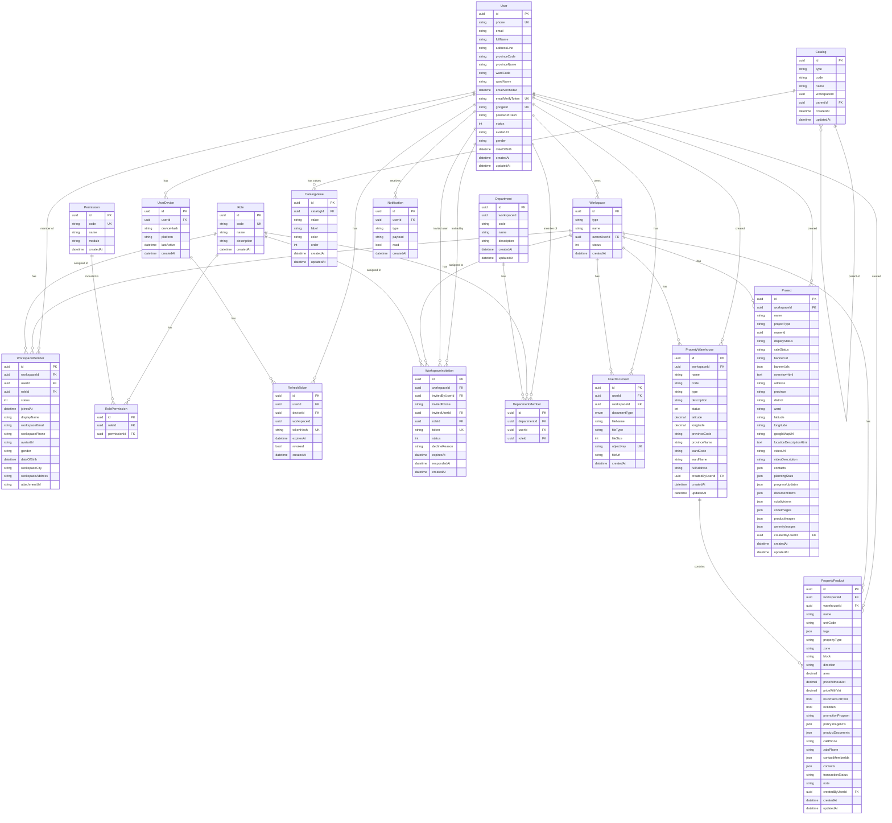

# PropCart CRM — Database Schema & API Reference

## Database ERD (Entity Relationship Diagram)

---

## API Reference

### 🔐 Auth — `/auth`

| Method | Endpoint | Description |
|--------|----------|-------------|
| POST | `/auth/phone/send-otp` | Gửi OTP đến số điện thoại |
| POST | `/auth/phone/verify-otp` | Xác thực OTP, trả về JWT |
| POST | `/auth/google` | Đăng nhập bằng Google OAuth |
| POST | `/auth/refresh` | Làm mới access token |
| POST | `/auth/switch-workspace` | Chuyển workspace đang dùng |
| GET  | `/auth/workspaces` | Lấy danh sách workspaces của user |
| POST | `/auth/logout` | Đăng xuất, revoke refresh token |
| GET  | `/auth/email/verify` | Xác thực email qua token |

---

### 👤 User / Profile — `/me`

| Method | Endpoint | Description |
|--------|----------|-------------|
| GET    | `/me/profile` | Lấy thông tin profile |
| PATCH  | `/me/profile` | Cập nhật profile |
| POST   | `/me/profile/email/send-verification` | Gửi email xác thực |
| POST   | `/me/profile/upload-avatar` | Upload ảnh đại diện |
| GET    | `/me/profile/documents` | Danh sách tài liệu cá nhân |
| POST   | `/me/profile/documents` | Upload tài liệu cá nhân |
| GET    | `/me/profile/documents/:documentId/download` | Download tài liệu |
| PATCH  | `/me/profile/documents/:documentId/type` | Cập nhật loại tài liệu |
| DELETE | `/me/profile/documents/:documentId` | Xóa tài liệu |

---

### 🏢 Workspace

| Method | Endpoint | Description |
|--------|----------|-------------|
| GET    | `/me/invitations` | Danh sách lời mời của user |
| POST   | `/invitations/:token/accept` | Chấp nhận lời mời |
| POST   | `/invitations/:token/decline` | Từ chối lời mời |
| POST   | `/workspaces/:workspaceId/invitations` | Tạo lời mời thành viên |
| GET    | `/workspaces/:workspaceId/invitations` | Danh sách lời mời |
| GET    | `/workspaces/:workspaceId/invitations/declined` | Lời mời đã từ chối |
| DELETE | `/workspaces/:workspaceId/invitations/:invitationId` | Hủy lời mời |
| GET    | `/workspaces/:workspaceId/members` | Danh sách thành viên |
| PATCH  | `/workspaces/:workspaceId/members/:memberId` | Cập nhật thành viên |
| POST   | `/workspaces/:workspaceId/members/:memberId/upload-avatar` | Upload avatar thành viên |

---

### 📋 Catalog — `/workspaces/:workspaceId/catalogs`

| Method | Endpoint | Description |
|--------|----------|-------------|
| POST   | `/workspaces/:workspaceId/catalogs` | Tạo danh mục |
| GET    | `/workspaces/:workspaceId/catalogs` | Danh sách danh mục |
| GET    | `/workspaces/:workspaceId/catalogs/:id` | Chi tiết danh mục |
| PATCH  | `/workspaces/:workspaceId/catalogs/:id` | Cập nhật danh mục |
| DELETE | `/workspaces/:workspaceId/catalogs/:id` | Xóa danh mục |

---

### 🏛 Department — `/workspaces/:workspaceId/departments`

| Method | Endpoint | Description |
|--------|----------|-------------|
| POST   | `/workspaces/:workspaceId/departments` | Tạo phòng ban |
| GET    | `/workspaces/:workspaceId/departments` | Danh sách phòng ban |
| GET    | `/workspaces/:workspaceId/departments/member-options` | Danh sách nhân sự có thể thêm |
| GET    | `/workspaces/:workspaceId/departments/role-options` | Danh sách vai trò |
| GET    | `/workspaces/:workspaceId/departments/member-search` | Tìm kiếm nhân sự |
| PATCH  | `/workspaces/:workspaceId/departments/:id` | Cập nhật phòng ban |
| DELETE | `/workspaces/:workspaceId/departments/:id` | Xóa phòng ban |
| POST   | `/workspaces/:workspaceId/departments/:departmentId/members` | Thêm nhân sự vào phòng |
| PATCH  | `/workspaces/:workspaceId/departments/:departmentId/members/:userId/role` | Cập nhật vai trò nhân sự |
| DELETE | `/workspaces/:workspaceId/departments/:departmentId/members/:userId` | Xóa nhân sự khỏi phòng |

---

### 🔔 Notification — `/me/notifications`

| Method | Endpoint | Description |
|--------|----------|-------------|
| GET    | `/me/notifications` | Danh sách thông báo |
| GET    | `/me/notifications/count` | Số thông báo chưa đọc |
| PATCH  | `/me/notifications/:id/read` | Đánh dấu đã đọc |
| GET    | `/me/notifications/stream` | SSE stream thông báo real-time |

---

### 🔑 Permission — `/workspaces/:workspaceId/permissions`

| Method | Endpoint | Description |
|--------|----------|-------------|
| GET    | `/workspaces/:workspaceId/permissions` | Danh sách permissions |
| POST   | `/workspaces/:workspaceId/permissions` | Tạo permission |
| POST   | `/workspaces/:workspaceId/permissions/roles/:roleId` | Gán permission cho role |
| DELETE | `/workspaces/:workspaceId/permissions/roles/:roleId/:permissionId` | Xóa permission khỏi role |

---

### 🏷 Role — `/workspaces/:workspaceId/roles`

| Method | Endpoint | Description |
|--------|----------|-------------|
| POST   | `/workspaces/:workspaceId/roles` | Tạo role |
| GET    | `/workspaces/:workspaceId/roles` | Danh sách roles |
| PATCH  | `/workspaces/:workspaceId/roles/:id` | Cập nhật role |
| DELETE | `/workspaces/:workspaceId/roles/:id` | Xóa role |

---

### 🏗 Warehouse — `/workspaces/:workspaceId/warehouses`

| Method | Endpoint | Description |
|--------|----------|-------------|
| POST   | `/workspaces/:workspaceId/warehouses` | Tạo kho hàng |
| GET    | `/workspaces/:workspaceId/warehouses` | Danh sách kho hàng |
| GET    | `/workspaces/:workspaceId/warehouses/:id` | Chi tiết kho hàng |
| PATCH  | `/workspaces/:workspaceId/warehouses/:id` | Cập nhật kho hàng |
| DELETE | `/workspaces/:workspaceId/warehouses/:id` | Xóa kho hàng |

---

### 📦 Product — `/workspaces/:workspaceId/products`

| Method | Endpoint | Description |
|--------|----------|-------------|
| POST   | `/workspaces/:workspaceId/products` | Tạo sản phẩm |
| GET    | `/workspaces/:workspaceId/products` | Danh sách sản phẩm |
| GET    | `/workspaces/:workspaceId/products/:id` | Chi tiết sản phẩm |
| PATCH  | `/workspaces/:workspaceId/products/:id` | Cập nhật sản phẩm |
| DELETE | `/workspaces/:workspaceId/products/:id` | Xóa sản phẩm |
| POST   | `/workspaces/:workspaceId/products/upload-files` | Upload file sản phẩm |

---

### 🏙 Project — `/workspaces/:workspaceId/projects`

| Method | Endpoint | Description |
|--------|----------|-------------|
| POST   | `/workspaces/:workspaceId/projects` | Tạo dự án |
| GET    | `/workspaces/:workspaceId/projects` | Danh sách dự án |
| GET    | `/workspaces/:workspaceId/projects/:id` | Chi tiết dự án |
| PATCH  | `/workspaces/:workspaceId/projects/:id` | Cập nhật dự án |
| DELETE | `/workspaces/:workspaceId/projects/:id` | Xóa dự án |
| POST   | `/workspaces/:workspaceId/projects/upload-image` | Upload hình ảnh dự án |

---

### 📁 Upload — `/upload`

| Method | Endpoint | Description |
|--------|----------|-------------|
| POST   | `/upload/temp` | Upload file tạm thời (TTL 24h) |

---

### 🌐 Portal (Public API) — `/portal`

| Method | Endpoint | Description |
|--------|----------|-------------|
| GET    | `/portal/:workspaceId/projects` | Danh sách dự án công khai |
| GET    | `/portal/:workspaceId/projects/:id` | Chi tiết dự án công khai |
| GET    | `/portal/:workspaceId/project-types` | Loại dự án |
| GET    | `/portal/:workspaceId/provinces` | Danh sách tỉnh/thành |
| GET    | `/portal/:workspaceId/catalog-options` | Tùy chọn danh mục |
| GET    | `/portal/:workspaceId/products/:id` | Chi tiết sản phẩm công khai |
| POST   | `/portal/:workspaceId/products/:id/booking-request` | Gửi yêu cầu đặt cọc |

---

## Summary

| Module | Tables | APIs |
|--------|--------|------|
| Auth | - | 8 |
| User/Profile | users, user_documents, user_devices, refresh_tokens | 9 |
| Workspace | workspaces, workspace_members, workspace_invitations | 10 |
| Catalog | catalogs, catalog_values | 5 |
| Department | departments, department_members | 10 |
| Notification | notifications | 4 |
| Permission | permissions, role_permissions | 4 |
| Role | roles | 4 |
| Warehouse | property_warehouses | 5 |
| Product | property_products | 6 |
| Project | projects | 6 |
| Upload | - | 1 |
| Portal | - | 7 |
| **Total** | **16 tables** | **79 APIs** |
